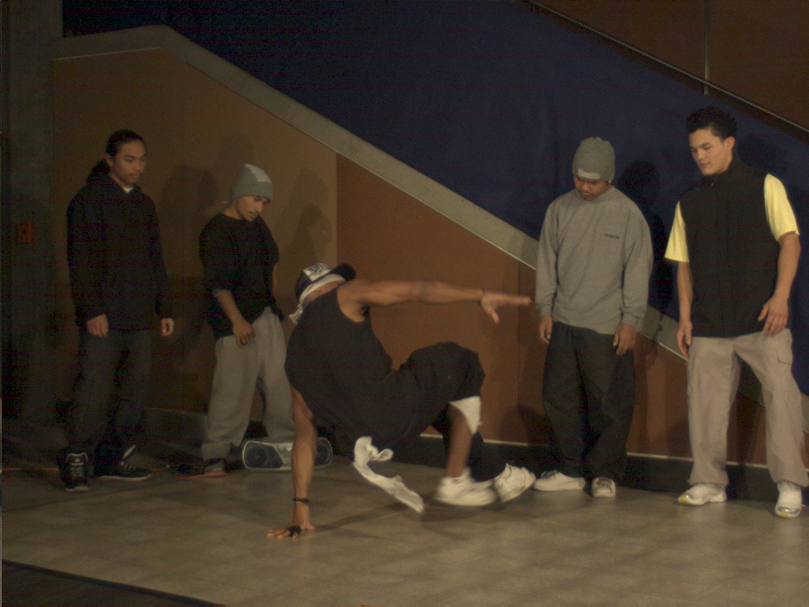
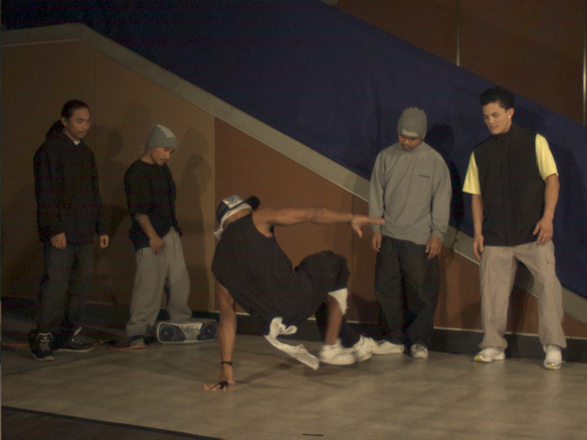
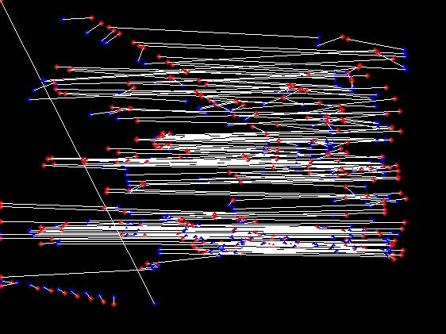
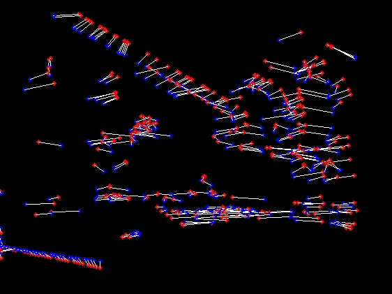

## Shape Matching 

The codes are copied from [here](https://github.com/sushruta/shape-context-matching), which is a c++ implementation of [Shape Matching](http://www.cs.berkeley.edu/~malik/papers/BMP-shape.pdf).

I convert the code to a more suitable for my own [project](https://github.com/wsAndy/ViewAndTime).

## Build

    mkdir build;
    cd build;
    cmake ..
    make -j4
    
## Run 

    ./match

####Here is the result.

